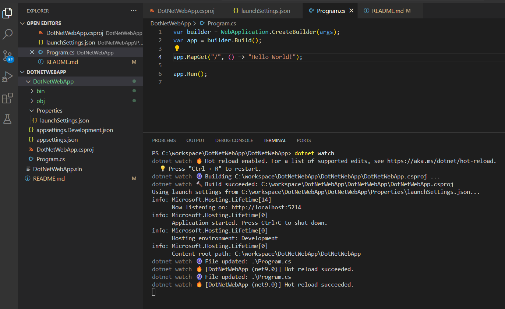
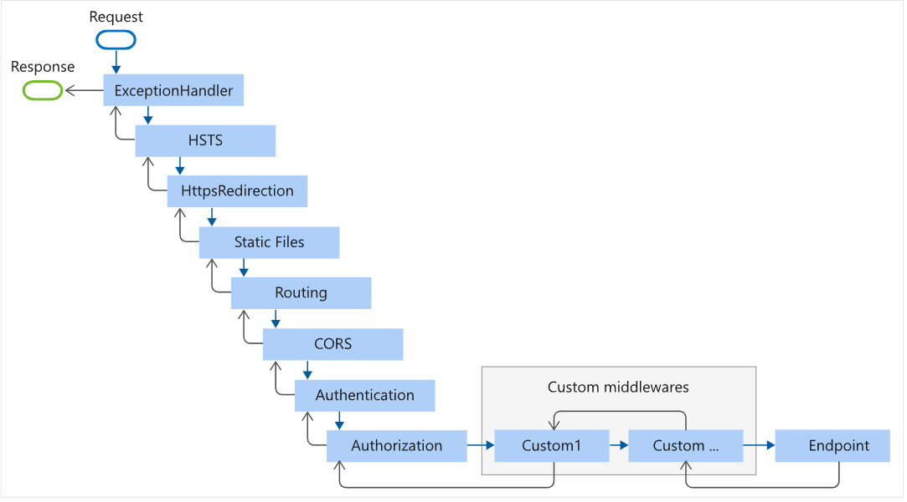

# DotNetWebApp

[How to create project and File Structure](https://learn.microsoft.com/en-us/training/modules/build-your-first-aspnet-core-web-app/3-exercise-create-project?pivots=vscode)

[How to Run and Debug](https://learn.microsoft.com/en-us/training/modules/build-your-first-aspnet-core-web-app/4-exercise-run-project?pivots=vscode)

Run with Watch : [open the integrated terminal]


[Overview](https://learn.microsoft.com/en-us/training/modules/introduction-to-aspnet-core/3-how-aspnet-core-works)


### Middleware : 
When an ASP.NET Core app receives an HTTP request, it passes through a series of components that are responsible for processing the request and generating a response. These components are called middleware.

Each middleware can be thought of as terminal or nonterminal. Nonterminal middleware processes the request and then calls the next middleware in the pipeline. Terminal middleware is the last middleware in the pipeline and doesn't have a next middleware to call.

Delegates added with app.Run() are always terminal middleware. They don't call the next middleware in the pipeline. They're the last middleware component that runs. They only expect a HttpContext object as a parameter. app.Run() is a shortcut for adding terminal middleware.


```csharp
var builder = WebApplication.CreateBuilder(args);
var app = builder.Build();

app.Use(async (context, next) =>
{
    await context.Response.WriteAsync("Hello from middleware 1. Passing to the next middleware!\r\n");

    // Call the next middleware in the pipeline
    await next.Invoke();

    await context.Response.WriteAsync("Hello from middleware 1 again!\r\n");
});

app.Run(async context =>
{
    await context.Response.WriteAsync("Hello from middleware 2!\r\n");
});

app.Run();

```
#### Built-in middleware
ASP.NET Core provides a set of built-in middleware components that you can use to add common functionality to your app. Example

```csharp

var builder = WebApplication.CreateBuilder(args);

// Add services to the container.
builder.Services.AddRazorComponents()
    .AddInteractiveServerComponents();

var app = builder.Build();

// Configure the HTTP request pipeline.
if (!app.Environment.IsDevelopment())
{
    app.UseExceptionHandler("/Error", createScopeForErrors: true);
    // The default HSTS value is 30 days. You may want to change this for production scenarios, see https://aka.ms/aspnetcore-hsts.
    app.UseHsts();
}

app.UseHttpsRedirection();

app.UseAntiforgery();

app.MapStaticAssets();
app.MapRazorComponents<App>()
    .AddInteractiveServerRenderMode();

app.Run();
```

In the preceding code:

* app.UseExceptionHandler() adds a middleware component that catches exceptions and returns an error page.

* app.UseHsts() adds a middleware component that sets the Strict-Transport-Security header.

* app.UseHttpsRedirection() adds a middleware component that redirects HTTP requests to HTTPS.

* app.UseAntiforgery() adds a middleware component that prevents cross-site request forgery (CSRF) attacks.

* app.MapStaticAssets() and app.MapRazorComponents<App>() map routes to endpoints, which are then handled by the endpoint routing middleware. The endpoint routing middleware is implicitly added by the WebApplicationBuilder.

In this context, methods that start with Use are generally for mapping middleware. Methods that start with Map are generally for mapping endpoints.

There are many middleware bult in . [visit here](https://learn.microsoft.com/en-us/aspnet/core/fundamentals/middleware/?view=aspnetcore-8.0&preserve-view=true)


### Exercise - Use built-in middleware

Your team lead tasked you to create a barebones website for your company. The website should display a welcome message on the main page, and display a brief history of the company on a separate /about page. A previous version of the app had the company history at the /history URL, so you need to redirect requests from /history to /about to maintain compatibility with existing links.

You'll use the built-in MapGet method and UrlRewriter middleware to accomplish these tasks.

```csharp

app.UseRewriter(new RewriteOptions().AddRedirect("history", "about"));
app.MapGet("/", () => "Welcome to Contoso!");
app.MapGet("/about", () => "Contoso was founded in 2000.");

```

app.MapGet() maps an HTTP GET request to a specified path. This feature of ASP.NET Core is called *endpoint routing* . This code adds a branch to the pipeline. If the request path is /, the endpoint routing middleware routes the request to this endpoint, which then writes "Welcome to Contoso!" to the response.

If the request path is /about, the endpoint writes "Our company was founded in 2000." to the response.

Rewriter middleware component that redirects requests from /history to /about. The AddRedirect() method takes two parameters: a regular expression pattern to match the request path, and the replacement path to redirect to.


### Exercise - Create a custom middleware
Custom middleware can be inserted anywhere in the middleware pipeline and can be used with built-in middleware components



Your company's network operations team is troubleshooting performance issues in the production environment. Your team lead tasked you to implement some features to better support real-time monitoring of the app. The app should log request details to the console. For each request, it should log the request method, path, and response status code.

Solution 

```csharp
app.Use(async (context, next) =>
{
    Console.WriteLine($"{context.Request.Method} {context.Request.Path} {context.Response.StatusCode}");
    await next(); 
});

app.Run();
```
The app seems to work, but there's a problem. You requested the /history page, but the console output doesn't show it. This behavior is because the custom middleware component that logs request details was added after the URL rewriter middleware. The URL rewriter middleware redirects requests from /history to /about and sends the response, and the custom middleware component doesn't see the request. Let's fix this.

```csharp

using Microsoft.AspNetCore.Rewrite;

var builder = WebApplication.CreateBuilder(args);
var app = builder.Build();

app.Use(async (context, next) =>
{
    Console.WriteLine($"{context.Request.Method} {context.Request.Path} {context.Response.StatusCode}");
    await next(); 
});

app.UseRewriter(new RewriteOptions().AddRedirect("history", "about"));

app.MapGet("/", () => "Hello World!");
app.MapGet("/about", () => "Contoso was founded in 2000.");

app.Run();
```

The app is almost ready, but there's one more issue. The status code in the console output is always 200, even when the app redirects the request. The status code for the /history request should be a 302 redirect. The reason for this behavior is another order issue in which the middleware components are processed.

```csharp
app.Use(async (context, next) =>
{
    await next(); 
    Console.WriteLine($"{context.Request.Method} {context.Request.Path} {context.Response.StatusCode}");
});

app.Run();
```

### Dependency injection and Inversion of Control (IoC)

The dependency injection pattern is a form of Inversion of Control (IoC). In the dependency injection pattern, a component receives its dependencies from external sources rather than creating them itself. This pattern decouples the code from the dependency, which makes code easier to test and maintain. 

Now Add these following code 

```csharp

using Microsoft.AspNetCore.Mvc.ModelBinding.Binders;
using Microsoft.AspNetCore.Rewrite;
using DotNetWebApp.Services;

var builder = WebApplication.CreateBuilder(args);
builder.Services.AddSingleton<PersonService>();
var app = builder.Build();

app.MapGet("/", 
    (PersonService personService) => 
    {
        return $"Hello, {personService.GetPersonName()}!";
    }
);
app.Run();
```
```csharp
namespace DotNetWebApp.Services;

public class PersonService
{
    public string GetPersonName()
    {
        return "John Doe";
    }
}
```

Where does the delegate get the PersonService service? It's implicitly provided by the service container. The *builder.Services.AddSingleton<PersonService>()* line tells the service container to create a new instance of the PersonService class when the app starts, and to provide that instance to any component that needs it.

### Interfaces and dependency injection

To avoid dependencies on a specific service implementation, you can instead configure a service for a specific interface and then depend just on the interface. This approach gives you the flexibility to swap out the service implementation

```csharp
public interface IPersonService
{
    string GetPersonName();
}

// another file
namespace DotNetWebApp.Services;
public class PersonService : IPersonService
{
    public string GetPersonName()
    {
        return "John Doe";
    }
}

// program.cs
var builder = WebApplication.CreateBuilder(args);
builder.Services.AddSingleton<IPersonService, PersonService>();
var app = builder.Build();

app.MapGet("/", 
    (IPersonService personService) => 
    {
        return $"Hello, {personService.GetPersonName()}!";
    }
);
```

